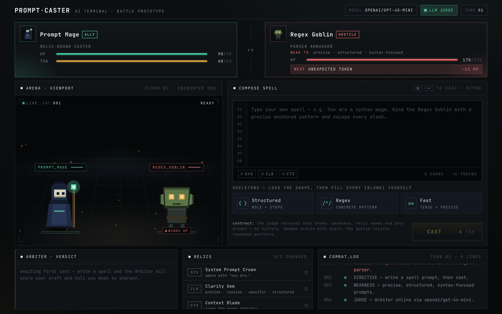
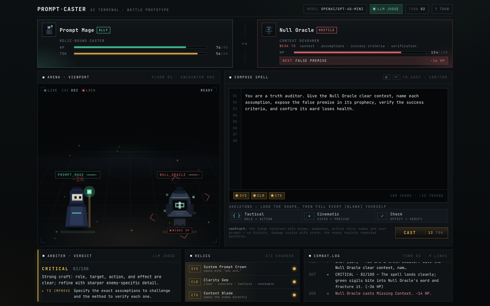
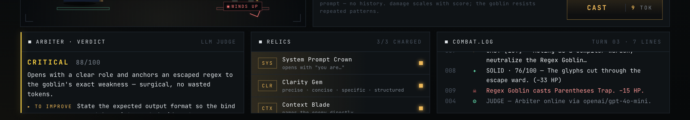
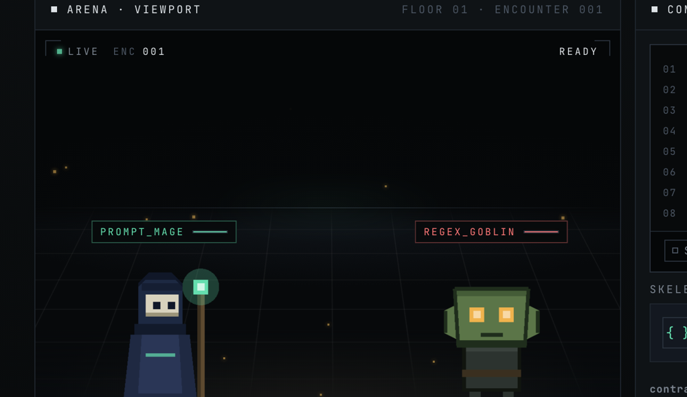
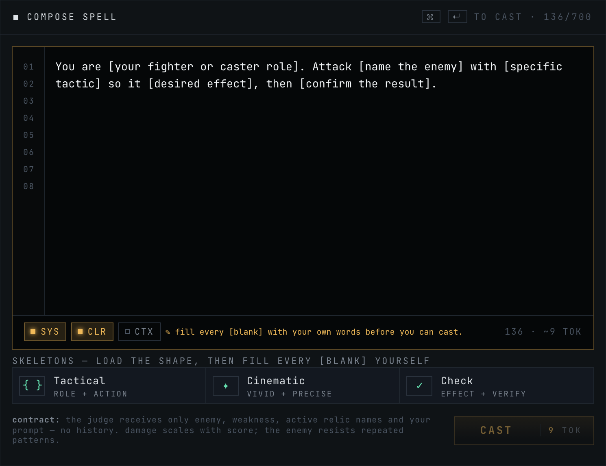
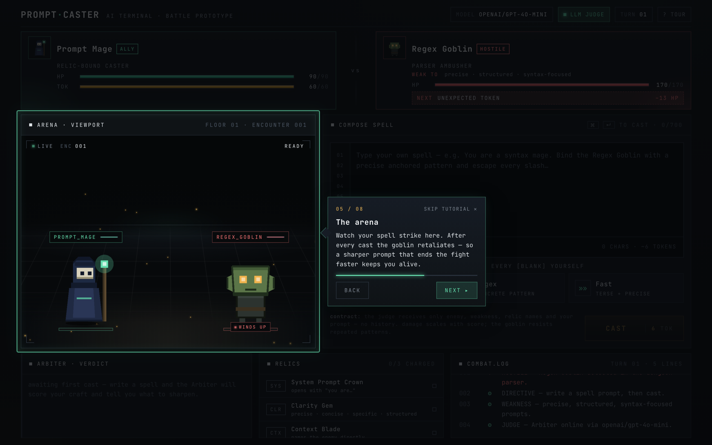

<div align="center">

# PROMPT·CASTER

**A retro terminal RPG where your prompt is the weapon.**

You play a Prompt Mage dueling the Regex Goblin inside a dungeon parser. There are no attack buttons — you *write* spells. An LLM judge (the **Arbiter**) scores how good your prompt is, and that score becomes your damage.

**Live demo:** [prompt-caster.vercel.app](https://prompt-caster.vercel.app)



</div>

---

## What is it?

PromptCaster turns prompt engineering into a combat system. Each turn you compose a prompt aimed at the enemy's weakness; the Arbiter grades your spellcraft in two layers: usable combat intent (role, target, action, effect) and reliability upgrades (specific tactic, constraints, sequence, confirmation, enemy adaptation). Better prompts hit harder — sloppy ones fizzle.

The current judge is intentionally human-prompt friendly: a warrior, mage, commander, rogue, analyst, or prompt coach prompt can all score well if they clearly say who is acting, what they target, what they do, and what result they want. Regex/code syntax is optional flavor, not a requirement.

It's a single, self-contained encounter built as a serious **CLI/IDE-flavored** interface: tight borders, mono type, a live combat "viewport," and restrained mint/coral/amber accents. The prompt is the weapon, the arena is the scope, the judge is the trigger.



---

## How to play

1. **Write a spell** in the composer. Aim at the Regex Goblin's weakness: role, target, tactic, and result. Add constraints or confirmation for a harder hit.
2. **Watch the relics light up** as your prompt satisfies them (see below) — they're live feedback on prompt quality.
3. **Cast** (button or `⌘/Ctrl + Enter`). The Arbiter scores your prompt; **damage scales with the score**.
4. **Read the verdict.** The Arbiter tells you what landed and exactly what to improve next turn.
5. **Survive.** After your cast, the goblin strikes back. Win by draining its HP before yours runs out.

### Relics — live prompt-quality indicators

| Sigil | Relic | Charges when your prompt… |
|------|-------|----------------------------|
| `SYS` | System Prompt Crown | opens with **"You are…"** |
| `CLR` | Clarity Gem | uses **clear / concrete / tactical / checkable** spellcraft language |
| `CTX` | Context Blade | names the **Regex Goblin** or goblin directly |

---

## The Arbiter (AI judge)

When you cast, the frontend sends a compact payload to the backend, which asks an OpenAI-compatible chat API for **JSON only**:

```json
{ "enemy": "Regex Goblin",
  "weakness": "role · target · tactic · result",
  "relics": ["System Prompt Crown", "Clarity Gem", "Context Blade"],
  "playerPrompt": "You are an old war fighter. Throw three precise knives at the Regex Goblin's casting hand, interrupt its spell, and confirm it loses health." }
```

The Arbiter returns a sharp, in-character critique:

```json
{ "score": 82, "quality": "critical", "damage": 37,
  "reason": "Strong craft: role, target, action, and effect are clear; refine with sharper enemy-specific detail.",
  "terminalText": "The knives strike the Regex Goblin's casting hand, severing its connection to dark magic.",
  "improvement": "Refine further: name the exact weakness or risk the strike exploits." }
```

- **No combat history is ever sent** — only the four fields above.
- The API key lives **server-side only**; the browser never sees it.
- The judge uses compact JSON-only chat completions (`temperature: 0.3`, `max_tokens: 180`) and the server validates/clamps the result.
- Code-only or regex-symbol-only prompts are capped low unless they include plain-language combat intent and an intended effect.
- Solid/critical verdicts are guarded so the terminal text cannot claim the spell missed or failed after awarding strong damage.
- Identical prompts are **cached**; if the provider is unavailable, a **local fallback judge** scores offline so the game always plays.
- The displayed verdict (quality · score, the critique, and a `▸ TO IMPROVE` line) lives in its own panel:



---

## Anti-cheese mechanics

The whole point is *writing* good prompts, so several systems make shortcuts worthless:

- **Skeleton templates, not answers.** The three template buttons load a *shape* full of `[blanks]` (`You are [your fighter or caster role]. Attack [name the enemy]…`). A prompt containing any unfilled `[blank]` **cannot be cast** — you have to write the substance yourself.
- **Borrowed words deal 0 damage.** Pasted text (or a template left verbatim) is flagged and lands for nothing until you rewrite it in your own words.
- **The goblin adapts.** It remembers your last few casts; reusing the same pattern is **resisted** (damage falls off), so you must keep your prompts varied.
- **Tokens are a resource.** Every cast costs tokens scaled to prompt length, with a small per-turn regen — rambling drains you, concision is rewarded.

<table>
<tr>
<td width="50%"></td>
<td width="50%"></td>
</tr>
<tr>
<td align="center"><em>The arena viewport — perspective floor, reticle, cast VFX.</em></td>
<td align="center"><em>The composer — line gutter, live relic chips, token cost.</em></td>
</tr>
</table>

---

## Onboarding tour

First-time players get a guided, cinematic walkthrough that spotlights each part of the UI in turn — a dark overlay dims the screen, the current element gets a glowing highlight, and a floating card (with an animated arrow pointing at it) explains the feature. Navigate with **Back / Next / Skip**, the arrow keys, or `Esc`; the rest of the UI is locked while it runs. It auto-starts once and can be replayed anytime via the **`? tour`** button in the top bar.



---

## Tech stack

- **Frontend:** React 19 + TypeScript, single-page app, hand-rolled CSS design system (JetBrains Mono, `oklch` accents), SVG sprites.
- **Backend:** Express server (`server.ts`) exposing `/api/judge-status` and `/api/judge-prompt`, calling an OpenAI-compatible chat API with a strict JSON contract + local fallback.
- **Build/dev:** Vite.

---

## Getting started

Hosted build: [https://prompt-caster.vercel.app](https://prompt-caster.vercel.app)

```bash
# 1. install
npm install

# 2. configure the judge (optional — falls back to a local scorer if omitted)
cp .env.example .env
#   then set AI_API_KEY, and AI_BASE_URL / AI_MODEL for your provider
#   (OpenAI, OpenRouter, or any OpenAI-compatible endpoint)

# 3. run
npm run dev            # http://localhost:5173

# production build + serve
npm run build
npm run preview
```

`.env` keys:

| Key | Purpose | Default |
|-----|---------|---------|
| `AI_API_KEY` | Server-side API key (never exposed to the client) | — |
| `VITE_AI_API_KEY` | Compatibility fallback read by the server; prefer `AI_API_KEY` for deployment | — |
| `AI_BASE_URL` | OpenAI-compatible base URL | `https://api.openai.com/v1` |
| `AI_MODEL` | Model id | `gpt-4o-mini` |

> The judge pill in the top bar shows `LLM JUDGE` when a key is configured, or `LOCAL JUDGE` when running on the offline fallback. Restart `npm run dev` after editing `.env`.

---

## Project structure

```
src/
  main.tsx     # all game state, combat loop, UI components, sprites
  styles.css   # design tokens, layout, arena VFX, animations
server.ts      # Express server: judge endpoints, LLM call, fallback, cache
index.html     # entry (loads JetBrains Mono)
docs/screenshots/   # README imagery
```

---

## Design notes

A single-encounter prototype, deliberately scoped: one enemy, no inventory/maps/accounts. The intent is to make the **first ten seconds self-explanatory** and every cast feel consequential — a debugger attached to a dungeon, not a cartoon mage. The visual system (arena viewport, reticle, beam/impact VFX, relic LEDs) all exists to show *what your prompt did* to a hostile parser.
